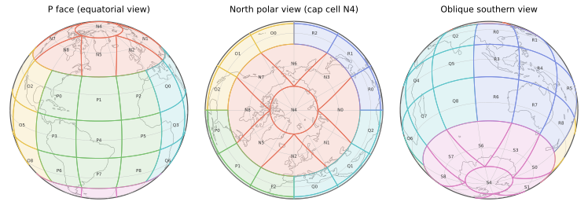

.. rHEALPixDGGS documentation master file.
   You can adapt this file completely to your liking, but it should at least
   contain the root `toctree` directive.

rHEALPixDGGS
===========================================

rHEALPixDGGS is a Python package that implements the rHEALPix discrete
global grid system (DGGS): a hierarchical partition of an ellipsoid of
revolution into equal-area cells, built on the rHEALPix map projection.

         globe from three viewpoints: an equatorial view facing the P
         face, a north polar view showing the circular cap cell
         surrounded by dart cells, and an oblique southern view.
   :width: 100%

Key API entry points
--------------------

.. list-table::
   :widths: 35 65
   :header-rows: 1

   * - Entry point
     - Purpose
   * - :class:`rhealpixdggs.dggs.RHEALPixDGGS`
     - A grid system on a chosen ellipsoid: cell lookup from points and
       regions, grid generation, cell areas and widths.
   * - :class:`rhealpixdggs.cell.Cell`
     - A single cell: geometry (nucleus, vertices, boundary, centroid),
       hierarchy (parents, children), neighbors, and topological
       predicates.
   * - :func:`rhealpixdggs.rhp_wrappers.geo_to_rhp` /
       :func:`~rhealpixdggs.rhp_wrappers.rhp_to_geo`
     - H3-style conversion between longitude-latitude points and cell
       addresses.
   * - :func:`rhealpixdggs.rhp_wrappers.polyfill`
     - Cells covering a polygon.
   * - :func:`rhealpixdggs.rhp_wrappers.linetrace`
     - Cells touched by a linestring.
   * - :func:`rhealpixdggs.rhp_wrappers.cell_ring` /
       :func:`~rhealpixdggs.rhp_wrappers.k_ring`
     - Rings and disks of cells around a cell.
   * - :func:`rhealpixdggs.conversion.compact_cells`
     - Merge complete groups of sibling cells into their parents.
   * - :class:`rhealpixdggs.ellipsoids.Ellipsoid`
     - The underlying ellipsoid of revolution (WGS84 and unit-sphere
       instances predefined).

Table of contents
-----------------

.. toctree::
   :maxdepth: 2

   introduction
   utils
   pj_healpix
   pj_rhealpix
   ellipsoids
   projection_wrapper
   dggs
   cell
   conversion
   rhp_wrappers

Indices and tables
==================

* :ref:`genindex`
* :ref:`modindex`
* :ref:`search`
