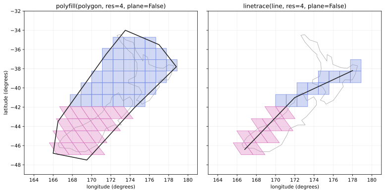

The rhp_wrappers Module
===========================

         country, with the resolution 4 cells whose centroids fall inside
         it drawn filled. Right: a three-point line from the southwest of
         the South Island to the east of the North Island, with the
         sequence of resolution 4 cells it passes through drawn filled.
   :width: 100%

   The H3-style wrappers over New Zealand: ``polyfill`` (left) returns
   the cells whose centroids fall inside a polygon; ``linetrace`` (right)
   returns the cells a line passes through, in order. The color change
   partway down the South Island is the boundary between the equatorial
   R cells (quads) and the south polar S cells (skew quads).

.. currentmodule:: rhealpixdggs.rhp_wrappers

.. autosummary::

    cell_area
    cell_ring
    geo_to_rhp
    k_ring
    linetrace
    polyfill
    rhp_get_base_cell
    rhp_get_resolution
    rhp_is_valid
    rhp_to_center_child
    rhp_to_geo
    rhp_to_geo_boundary
    rhp_to_parent

.. automodule:: rhealpixdggs.rhp_wrappers
    :members:
    :undoc-members:
    :show-inheritance:
